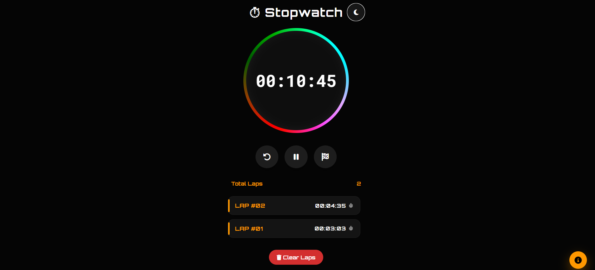

# SCT_WD_2 — Stopwatch Web Application

Web Development Internship (Task 02) — a modern, fully responsive stopwatch web app

A sleek, dark-themed stopwatch web application with lap tracking, built from scratch with HTML5, CSS3, and Vanilla JavaScript — no frameworks, no libraries.

**Project:** Web Development Internship — Task 02
## 📖 About the Project

This project demonstrates the implementation of a modern stopwatch application using HTML, CSS, and JavaScript. It focuses on accurate time tracking, interactive UI design, responsive layouts, DOM manipulation, local storage, and event handling while maintaining a clean and user-friendly interface.

🌐 **Live Demo:** https://radhika200gupta-tech.github.io/SCT_WD_2/

## 📸 Project Preview

---

## 🚀 Features

- **Animated rainbow ring** — a smoothly rotating conic-gradient ring frames the timer display
- **Start / Pause / Reset controls** — precise timing down to the millisecond
- **Lap tracking** — record laps on the fly, each shown with its own timestamp and total lap count
- **Dark / Light theme toggle** — one click to switch, with the choice remembered on reload
- **Keyboard shortcuts** — `Space` to start/pause, `L` to lap, `R` to reset, `D` to toggle theme
- **Persistent state** — laps and theme preference are saved via `localStorage`, so nothing is lost on refresh
- **Clear Laps** — quickly wipe the lap history without resetting the timer
- **Button ripple effect** — subtle press feedback on every control
- **Fully responsive** — scales cleanly from desktop down to mobile
- **Floating info panel** — a quick-reference card listing all keyboard shortcuts

## 📁 Folder Structure

SCT_WD_2/
├── index.html
├── style.css
├── script.js
├── stopwatch.png
└── README.md

## 🧩 Sections Included

- Header (title + theme toggle)
- Animated timer ring with live display
- Control buttons (Reset, Start/Pause, Lap)
- Lap counter and lap history list
- Clear Laps action
- Floating keyboard-shortcuts info panel

## 🎨 Design Tokens

| Token | Value |
|---|---|
| Background (dark) | `#050505` |
| Background (light) | `#f3f4f7` |
| Accent Orange | `#ff9800` |
| Text (dark mode) | `#FFFFFF` |
| Text (light mode) | `#111111` |
| Font (display) | Orbitron (Google Fonts) |
| Font (timer) | Roboto Mono (Google Fonts) |
| Icons | Font Awesome 6 |

## 🛠️ Tech Stack

- **HTML5** — semantic markup
- **CSS3** — custom animations, flexbox, no framework
- **Vanilla JavaScript (ES6+)** — no libraries
- **Font Awesome** — icon library (via CDN)
- **Google Fonts** — Orbitron & Roboto Mono (via CDN)

## ▶️ How to Run

No build tools or dependencies required.

1. Download or clone this repo
2. Keep `index.html`, `style.css`, and `script.js` in the same folder
3. Open `index.html` directly in your browser

> Note: Font Awesome icons and Google Fonts load via network requests, so an internet connection is needed for the page to look and work correctly.

## 📌 Notes

- Laps and theme preference persist locally using `localStorage` — no backend required.
- Accessibility basics included: keyboard shortcuts for all core actions and clear focus states on interactive elements.

## 👤 Author

**Radhika Gupta**
Frontend Developer | Web Development Enthusiast

Built as part of my Web Development Internship (Task 02) at SkillCraft Technology.
